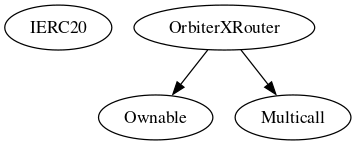

# Sample OrbiterX Project

 Files Description Table


|  File Name  |  SHA-1 Hash  |
|-------------|--------------|
|  /OrbiterX-contract/contracts/OrbiterXRouter.sol | 4b74056f4ccb963f8aaf8b7e705f34865fcda829 |


 Contracts Description Table


|  Contract  |         Type        |       Bases      |                  |                 |
|:----------:|:-------------------:|:----------------:|:----------------:|:---------------:|
|     └      |  **Function Name**  |  **Visibility**  |  **Mutability**  |  **Modifiers**  |
||||||
| **IERC20** | Interface |  |||
| └ | transfer | External ❗️ | 🛑  |NO❗️ |
| └ | balanceOf | External ❗️ |   |NO❗️ |
| └ | allowance | External ❗️ |   |NO❗️ |
| └ | transferFrom | External ❗️ | 🛑  |NO❗️ |
||||||
| **OrbiterXRouter** | Implementation | Ownable, Multicall |||
| └ | Constructor | Public ❗️ | 🛑  |NO❗️ |
| └ | Receive Ether | External ❗️ |  💵 |NO❗️ |
| └ | changeMaker | Public ❗️ | 🛑  | onlyOwner |
| └ | withdraw | External ❗️ | 🛑  | onlyOwner |
| └ | forward | Private 🔐 | 🛑  | |
| └ | swap | External ❗️ |  💵 |NO❗️ |
| └ | swapAnswer | External ❗️ |  💵 |NO❗️ |


 Legend

|  Symbol  |  Meaning  |
|:--------:|-----------|
|    🛑    | Function can modify state |
|    💵    | Function is payable |

### Inheritance Graph

### CallGraph


Try running some of the following tasks:

```shell
npx hardhat help
npx hardhat test
REPORT_GAS=true npx hardhat test
npx hardhat node
npx hardhat run scripts/deploy.ts
```